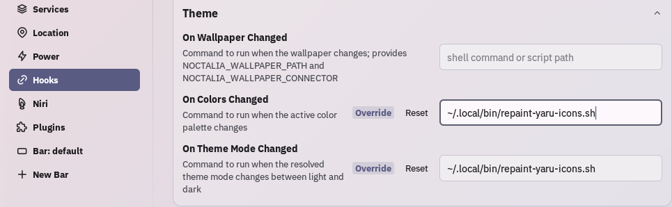

# Noctalia Yaru icons

Script that repaints [Yaru](https://github.com/ubuntu/yaru) icons to match [Noctalia](https://github.com/noctalia-dev/noctalia) theme.

https://github.com/user-attachments/assets/281f731e-073c-4ae3-a4f1-644c6f0aee00

## Prerequisites:

### Packages / Commands on `$PATH`
- **Python 3** — with the standard library `colorsys` module (used for the HSL modulate math)
- **ImageMagick** — provides the `convert` command
- **GNOME** — updates icon cache and icon theme
- `find`, `sed`, `awk`, `cp`, `mkdir` (standard on virtually any Linux system)

### Files / Directories
- `/usr/share/icons/Yaru` or `/usr/local/share/icons/Yaru`
- `$HOME/.icons/` must be writable
- `$HOME/.config/gtk-4.0/noctalia.css`

### Input
- Optionally, a hex color argument such as `"#8A2BE2"` to use instead of Noctalia accent color 
